# Scenario1-ElectricTunnel-Dataset
UE4-based electric tunnel environments and data (RGBD, Lidar, IMU, etc.) collection scripts.

## Download dataset (rosbag file for each map)
  
  **Data description**
  
  Total 5 electric tunnel environments were built, each with distinctive tunnel shape, electric wire shape, wall and floor texture, and objects arrangement. Each environment is named as "MAP****_origin" and the changed version is named as "MAP****_change". Every environment is saved in the form of rosbag file, which contains all necessary information to explore the environment.
  
  **Contents in the rosbag file**
  
  In rosbag file, various types of information helps exploring the electric tunnel environments is stored.
  
  - tf
  - Camera
    - Camera information
    - Rectified RGB image
    - Depth information
  - RTABMAP
    - Odometry information
    - Landmarks
    - OctoMap
    - Cloud map

  **Difference between the original and changed environment**
  
  There are several differences between the original and changed environment. The basic structure of the tunnel including tunnel shape, electric wire, and wall and floor texture remains the same. But the situation in the tunnel such as objects arrangement or emergencies are mainly changed.

  - Change of the object location
    - Fall of fire extinguishers, lamps and warning signs
    - Translation or rotation of boxes and tanks
    - Generation of unkown objects such as wires, boxes, and even human
    
  - Emegencies
    - Fire, smoke and heat
  
  **Download Links**
  
<p float="left">
  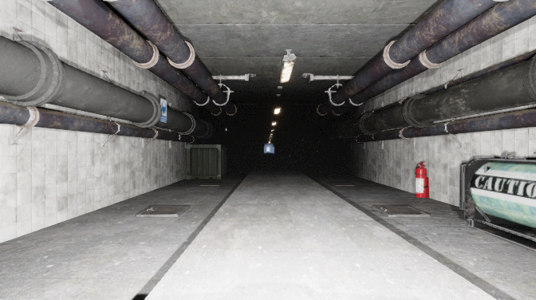
  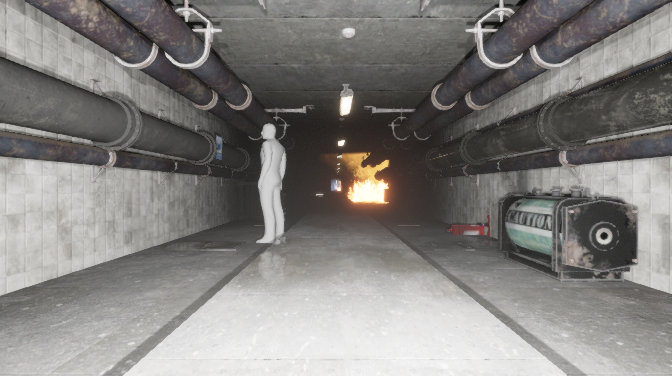 
</p>

  - [MAP0001_origin](https://drive.google.com/file/d/1_pSUbwMq98T1dgtgCeEd-ToUY7fZxlgm/view?usp=sharing, "MAP0001_origin") (1.15GB) 
  - [MAP0001_change](https://drive.google.com/file/d/1ZHmWIfhTQEjOIkAnlWg6cfE8iEFbHya_/view?usp=sharing, "MAP0001_change") (1.74GB)
  
<p float="left">
  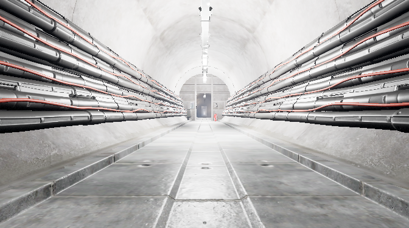
  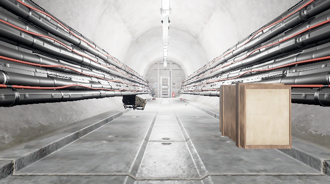 
</p>

  - [MAP0002_origin](https://drive.google.com/file/d/1y0Wv-iWMhhVl3zoDcdL9bVsMwpJhg8-A/view?usp=sharing, "MAP0002_origin") (1.18GB)
  - [MAP0002_change](https://drive.google.com/file/d/1rb7YVnYf7q-Y6M_5wWIRcSswI86kJ9SD/view?usp=sharing, "MAP0002_change") (0.57GB)

<p float="left">
  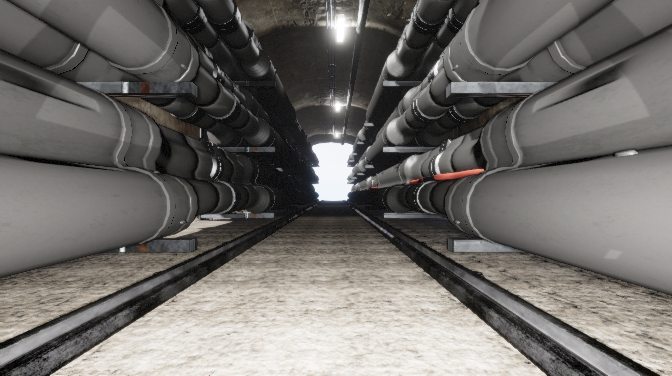
  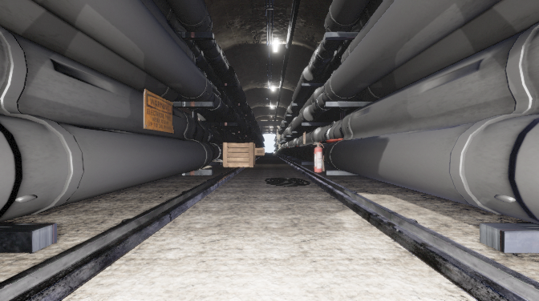 
</p>
  
  - [MAP0003_origin](https://drive.google.com/file/d/1fh94qG18Mayj5fE4xJ-gy9nhYKexIWoy/view?usp=sharing, "MAP0003_origin") (1.45GB)
  - [MAP0003_change](https://drive.google.com/file/d/1HstErqNMKtuD-67nAb3LWKUVB76LaOJ2/view?usp=sharing, "MAP0003_change") (1.13GB)
  
<p float="left">
  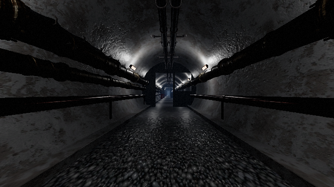
  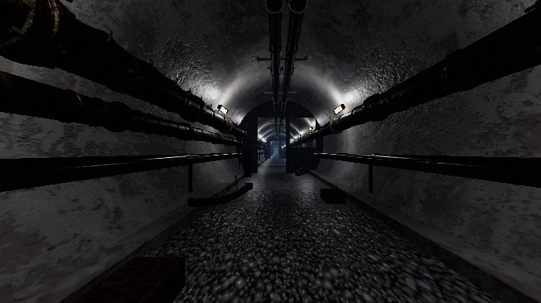 
</p>

  - [MAP0004_origin](https://drive.google.com/file/d/13MeAWOc5WOYVn9bAFwmjGGabcR8XtDoM/view?usp=sharing, "MAP0004_origin") (1.53GB)
  - [MAP0004_change](https://drive.google.com/file/d/1KA8X0KLJCEWDFL96Yf2U5dv6-ItSGqfU/view?usp=sharing, "MAP0004_change") (1.23GB)

<p float="left">
  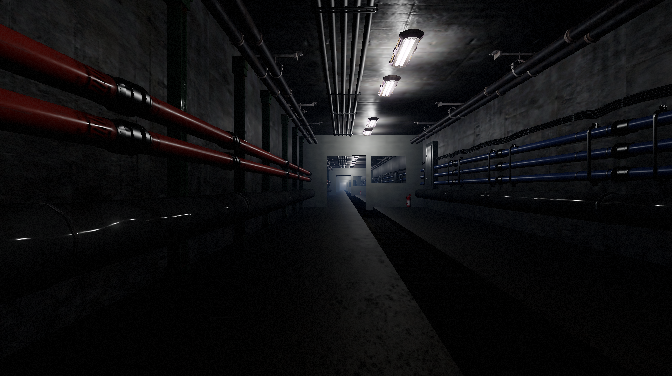
  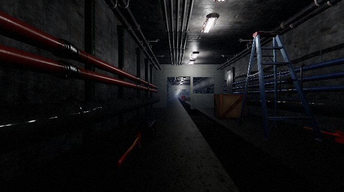 
</p>

  - [MAP0005_origin](https://drive.google.com/file/d/16kT7HrnBB4p73d2xkJU1tA271j-WaMye/view?usp=sharing, "MAP0005_origin") (1.09GB)
  - [MAP0005_change](https://drive.google.com/file/d/1-9mGh5VEs36ioS13555kJw8bbg6XFNV5/view?usp=sharing, "MAP0005_change") (1.34GB)
  
## Play with data

  Run follwing commands to visualize the information in the rosbag file.

  ```
  # new terminal
  source Airsim/ros/devel/setup.bash
  roslaunch rtabmap_ros rgbd_mapping.launch
  rosbag play map****_origin.bag
  ```
  
  Then the RTABMAP results will pop up as shown below.
  
  <p float="center">
    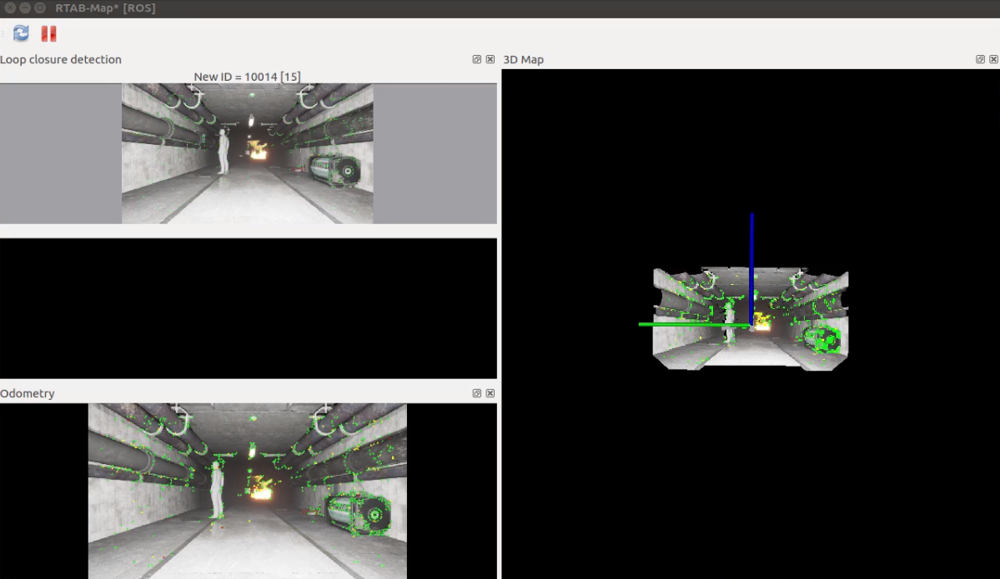
  </p>

  
## Create your own dataset

  **1. Environment setup (Install ROS, UE4, Airsim, RTABMAP, etc)**
  
  - Follow instructions [here](https://github.com/SAMMiCA/Scenario1-3D-Change-Detection/blob/main/README.md)

  **2. Build electric tunnel project with UE4**
  
   - Purchase and download maps from UE4 Epic Game Launcher
   - Tutorials [YouTube](https://www.youtube.com/watch?v=mKRrLJ4kmFE)
    
  **3. Run AirSim on the project**
  
  **4. Open new terminals**
  
   ```
   # new terminal for roscore
   roscore
   
   # new terminal for ros topics
   cd AirSim/PythonClient/car; python kinect_publisher_car.py
   
   # new terminal for RTABMAP
   source Airsim/ros/devel/setup.bash; roslaunch rtabmap_ros rgbd_mapping.launch
   
   # new terminal for saving
   rosbag record -a
   ```
   
 # Citations
 
 Please consider citing this project in your publications if it helps your research. The following is a BibTeX reference. The BibTeX entry requires the url LaTeX package.
 
 ```
 @misc{park2020change,
 author = {Park, Jinman and Yoo, Sangmin and Lee, Sunkyung and Jang, Jaehyuk},
 title = {{3D change Detection using image resynthesis from 3D mapping in underground environments}},
 year = {2020},
 publisher = {GitHub},
 journal = {GitHub repository},
 howpublished = {\url{https://github.com/SAMMiCA/Scenario1-3D-Change-Detection}}
 }
 ```
 
# Acknowledgement

This work was supported by Institute of Information & communications Technology Planning & Evaluation(IITP) grant funded by Korea government(MSIT) (No.2020-0-00440, Development of Artificial Intelligence Technology that Continuously Improves Itself as the Situation Changes in the Real World)
